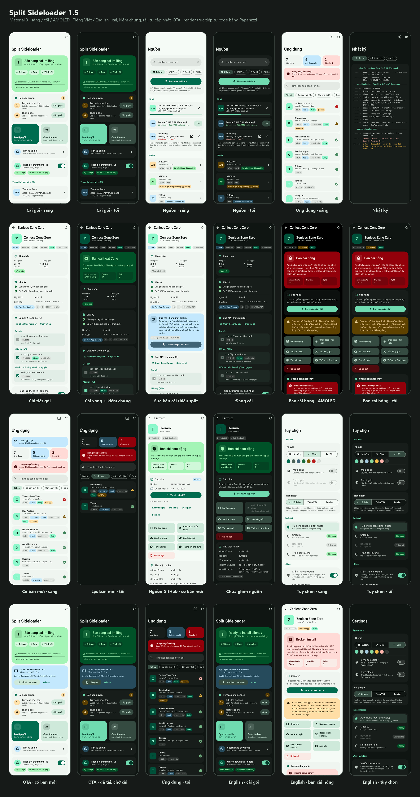

# Split Sideloader

Cài `.xapk` / `.apkm` / `.apks` **ngay trên máy Android**, đưa mọi split vào chung một
transaction, rồi **kiểm chứng thư viện native có thật sự được đăng ký hay không**.

Mọi thứ trước đây phải làm bằng script `adb install-multiple` trên máy tính, app làm trực
tiếp trên điện thoại.

---

## Vấn đề nó giải quyết

Các trình cài của store thường chỉ cài **base APK** rồi lặng lẽ bỏ ABI split. App hiện
đúng phiên bản, rồi chết khi mở:

```
dlopen failed: library "libmain.so" not found
```

Dấu hiệu nằm ở đúng một trường:

| `primaryCpuAbi` | Nghĩa |
|---|---|
| `arm64-v8a` | Thư viện native đã đăng ký. Tốt. |
| `null` | Không tìm thấy `lib/<abi>/` lúc cài. **Sẽ crash khi mở.** |

App hiển thị trường này sau mỗi lần cài, đọc bằng `dumpsys` khi có shell, bằng reflection
khi không, và đối chiếu thêm với nội dung thật của `nativeLibraryDir`.

---

## Khác biệt so với cách làm bằng script

| | Script `adb` trên máy tính | App này |
|---|---|---|
| Giải nén | Ra thư mục tạm, cần gấp đôi dung lượng | **Không giải nén** — stream thẳng từ ZIP vào session |
| Bắt file cụt | So sánh kích thước sau khi `unzip` | So kích thước **và CRC32** ghi trong chính gói, ngay trong lúc ghi |
| Nhận diện split | Đọc `manifest.json`, không có thì đoán theo tên | Đọc `AndroidManifest.xml` **nhị phân** trong từng APK con |
| Cần PC / adb | Có, phải ghép nối wireless debugging | Không, trừ khi muốn chạy im lặng bằng Shizuku |
| Kiểm chứng | `adb shell dumpsys` | Ngay trong app, kèm kết luận đỏ/xanh |
| Gói > 4 GB | `unzip` tùy bản | ZIP64 đầy đủ |

Việc **không giải nén** xử lý luôn hai bẫy quen thuộc của cách làm bằng script: thiếu dung
lượng, và `unzip` thoát mã 0 nhưng ghi ra file cụt.

---

## Cách cài (4 mức, tự dò lúc mở app)

Màn hình đầu tiên dò cả máy root lẫn không root, rồi liệt kê từng cách cùng trạng thái của
nó.

| Cách | Im lặng | Điều kiện |
|---|---|---|
| **Shizuku** | Có | Dịch vụ Shizuku đang chạy + đã cấp quyền |
| **Root (`su`)** | Có | Có `su` và bạn bấm "Thử" để cấp |
| **Trình cài thường** | Không | Luôn có; mỗi lần cài hiện 1 hộp thoại xác nhận |

"Im lặng" = cài không hiện hộp thoại nào, nên mới cài hàng loạt và cài tự động được.
Không có cách im lặng thì Android **bắt buộc** xác nhận từng lần — app nói thẳng điều đó
thay vì giả vờ tự động được.

Ngoại lệ duy nhất: từ Android 12 trở lên, **cập nhật một app do chính app này cài** thì
bỏ qua được hộp thoại. App tự phát hiện và dùng khi đủ điều kiện.

### Khởi động Shizuku từ Termux

Máy không root thì Shizuku phải khởi động lại qua ADB sau mỗi lần reboot. Bật
**Cài đặt → Tùy chọn nhà phát triển → Gỡ lỗi không dây**, rồi trong Termux:

```bash
pkg install android-tools
adb pair 127.0.0.1:PAIRING_PORT
adb connect 127.0.0.1:CONNECT_PORT
adb shell sh /sdcard/Android/data/moe.shizuku.privileged.api/start.sh
```

Màn hình ghép nối và màn hình chính hiện **hai cổng khác nhau** — dùng đúng cổng ở đúng
chỗ. Lệnh này có sẵn trong tab Tùy chọn của app, bấm là copy.

---

## Giao diện



Material 3, bảng màu tự thiết kế (xanh ngọc) cho **sáng**, **tối**, và tùy chọn **đen tuyền
(AMOLED)**; hoặc **màu động** theo hình nền trên Android 12+. Chọn Hệ thống / Sáng / Tối
trong tab Tùy chọn — thanh trạng thái và nền cửa sổ đổi theo lựa chọn, không theo hệ thống.
Ngoài xanh/đỏ chuẩn, có thêm cặp màu trạng thái riêng (xanh "chạy được", vàng "cần xem")
để mọi kết luận nhìn là hiểu.

Toàn bộ ảnh trong `docs/screenshots/` được render trực tiếp từ code bằng Paparazzi, với dữ
liệu mẫu đúng tình huống app sinh ra để xử lý: ZZZ cài qua QooApp bị rơi split ABI.

---

## Tính năng

### Mới trong 1.5 — chọn ngôn ngữ trong app

Tùy chọn → Giao diện → **Ngôn ngữ**: Hệ thống · Tiếng Việt · English. Đổi là màn hình dựng
lại ngay, không cần khởi động lại app, và không đụng gì tới ngôn ngữ của máy. Android 13 có
sẵn "ngôn ngữ theo ứng dụng" trong Cài đặt hệ thống, nhưng không phải ROM nào cũng hiện mục
đó, còn app này chạy từ 8.0 — nên nó tự làm lấy: đổi `Configuration` ngay ở
`attachBaseContext`, cho cả Activity, Application lẫn các worker chạy nền (thông báo cũng
theo ngôn ngữ đã chọn).

**Nhật ký vẫn giữ tiếng Anh** — cố ý. Nửa những gì nó in ra là `primaryCpuAbi`,
`INSTALL_FAILED_MISSING_SPLIT`, dòng logcat; dán vào báo lỗi hay hỏi người khác thì để
nguyên tiếng Anh vẫn đọc được. Mọi kết luận hiển thị trên màn hình thì mang **mã**, nên
luôn hiện đúng ngôn ngữ bạn chọn.

Ba ảnh cuối trong bảng trên là giao diện tiếng Anh, render từ chính bộ `values/strings.xml`
— không phải bản dịch rời, nên thiếu chuỗi nào là test ảnh thấy ngay.

### Mới trong 1.4 — OTA cho chính app này

App này cũng sideload, cũng không có store nào cập nhật hộ. Nên nó tự cập nhật lấy: khai
báo **kênh** trong tab Tùy chọn, ở mục "Ứng dụng này".

| Kênh | Điền gì | App làm gì |
|---|---|---|
| GitHub Releases | `owner/repo` hoặc link github.com | Đọc `releases/latest`, chọn asset đúng ABI của máy |
| Manifest JSON | `https://host/ota.json` | Đọc versionCode, link, SHA-256 và ghi chú |
| Tắt | để trống | Không tự tìm bản mới của chính nó |

`http://` thuần bị từ chối: ai đứng giữa đường truyền cũng sẽ chọn được bản kế tiếp của app.

**Ba cửa mọi bản OTA phải qua, trước khi cài:**

1. Đúng package `com.sideload.splitinstaller`.
2. `versionCode` cao hơn bản đang chạy — đọc từ chính `AndroidManifest.xml` nhị phân trong
   file tải về, không tin những gì kênh nói.
3. **Ký cùng chứng chỉ với bản đang chạy.** Đây mới là cửa quan trọng: kênh bị chiếm, host
   bị đổi, link bị chuyển hướng — tất cả đều dừng ở đây, vì không đường nào trong số đó tạo
   ra được một APK mà Android chịu nhận là bản cập nhật của bản này.

Thêm SHA-256 vào manifest thì file phải khớp đúng digest đó nữa.

**Tự cài được không?** Có, nếu có Shizuku/root — app ghi lại ý định vào `ota.json` rồi mới
commit, vì tiến trình bị giết ngay khi bản mới đáp xuống: app không thể tự chứng kiến mình
được thay. Lần mở kế tiếp nó đọc lại chỗ ghi đó để biết thành hay bại; **hai lần hỏng liên
tiếp thì thôi tự thử**, chỉ báo để bạn cài tay một lần và xem lỗi. Không có Shizuku/root thì
bản mới vẫn được tải và kiểm đủ ba cửa, rồi nằm chờ một cú chạm — Android bắt buộc phải có
xác nhận để thay một app đang chạy.

Phát hành: `ota.json` sinh sẵn theo từng bản build.

```bash
./gradlew :app:otaManifest -PotaBaseUrl=https://host/thu-muc
```

Ra `app/build/outputs/apk/release/ota.json`:

```json
{
  "versionCode": 6,
  "versionName": "1.5.0",
  "url": "https://host/thu-muc/SplitSideloader-1.5.0.apk",
  "fileName": "SplitSideloader-1.5.0.apk",
  "sha256": "…",
  "size": 11404023,
  "minSdk": 26,
  "notes": ""
}
```

Đặt hai file cạnh nhau ở bất cứ đâu phục vụ được HTTPS (GitHub Release, Pages, VPS, ổ mạng
của bạn), rồi trỏ kênh vào file JSON. Dùng GitHub Releases thì khỏi cần manifest — điền
`owner/repo` là xong.

Repo này tự làm việc đó: mỗi tag `vX.Y.Z` thì GitHub Actions build, ký, và đăng release kèm
cả APK lẫn `ota.json` (xem [Build bằng GitHub Actions](#build-bằng-github-actions)). Kênh nên
điền trong app là manifest của release mới nhất — có versionCode và SHA-256, chặt hơn kênh
chỉ đọc tên tag:

```
https://github.com/wdchocopie/split-sideloader/releases/latest/download/ota.json
```

Kênh GitHub chỉ đọc được release của **repo công khai**; repo riêng tư thì API trả 404 cho
app, vì app không mang theo token nào.

### Mới trong 1.3 — tự cập nhật

App sideload không tự cập nhật được, nên phải **ghim nguồn** cho từng gói. Trong chi
tiết ứng dụng, thẻ **Cập nhật** cho chọn một trong ba kiểu:

| Nguồn | Tự kiểm tra | Tự tải | Vì sao |
|---|---|---|---|
| **F-Droid** | có | có | `api/v1/packages/<pkg>` trả về `versionCode` chính xác và link APK trực tiếp |
| **GitHub** | có | có | `releases/latest` có tag và danh sách asset; app chọn đúng ABI của máy |
| **Trang web** (APKMirror, APKPure…) | không | không | không có API phiên bản, và `robots.txt` của họ cấm máy tự tải |

- **Kiểm tra nền** theo lịch (tắt / hằng ngày / hằng tuần) bằng WorkManager, giãn 1,2 giây
  giữa hai lần gọi để không dồn dập lên máy chủ người ta. Tùy chọn chỉ chạy khi có Wi-Fi.
- **So phiên bản thật**: F-Droid so `versionCode`; GitHub so từng số trong tag, biết
  `1.10 > 1.9` và `3.0.0-rc1 < 3.0.0`. **Không so được thì nói là không so được**, chứ
  không âm thầm bảo “đang mới nhất”.
- **Tải → cài → kiểm chứng, không cần chạm** (khi bật “Tự tải” + “Tự cài” và có
  Shizuku/root): tải xong thì `InstallWorker` kiểm tên gói đúng như gói đã ghim, cài qua
  đúng luồng split như mọi gói khác, rồi báo kết luận kiểm chứng.
- **Trang đã ghim** thì app nhắc bằng thông báo và mở đúng trang đó — bạn bấm tải, phần
  còn lại app lo. Ghim ngay trong trình duyệt tích hợp: tìm app → thanh “Ghim trang này”.
- **Tab Ứng dụng** có bộ lọc **Có bản mới**, số trên icon tab, và viên `→ 1.61.0` ngay
  trên từng dòng.
- **Chạy nền thật sự**: đặt lịch lại sau khi khởi động máy và sau khi cập nhật chính app
  này; cảnh báo + nút xin miễn tối ưu pin cho các ROM hay đóng băng tiến trình nền; và **báo
  khi Shizuku đã tắt** sau reboot — máy không root thì Shizuku không sống qua lần khởi
  động, nên tự cài sẽ dừng cho đến khi bạn chạy lại nó từ Termux.

### Mới trong 1.2 — tìm và tải từ nguồn

- **Tab Nguồn** với trình duyệt tích hợp: APKMirror, APKPure, F-Droid, GitHub Releases, và
  nguồn tự thêm (trang chủ + URL tìm kiếm có `{q}`). Gõ tên app một lần, app mở đúng trang
  tìm kiếm của nguồn đã chọn.
- **Bấm nút tải của trang là xong**: app bắt lượt tải (kèm cookie và user-agent của trang),
  giao cho DownloadManager của hệ thống — chạy nền, nối lại khi rớt mạng, chịu được file vài
  GB — lưu vào `Download/SplitSideloader/`, tải xong thì **tự mở màn cài** với đủ bước kiểm
  tra chữ ký/split như mọi gói khác.
- **"Tìm bản mới"** trong chi tiết ứng dụng: tìm luôn tên app đó trên nguồn đang chọn —
  cách cập nhật cho app sideload, vốn không tự cập nhật được.
- Thư mục `Download/SplitSideloader/` (file tải về và bản sao lưu) **không** bị bộ theo dõi
  thư mục tự cài, để bản sao lưu không bao giờ bị cài đè ngược lên bản đang cập nhật.

App **không** tải ngầm hay đọc trộm trang: APKPure chặn truy cập tự động bằng Cloudflare,
điều khoản của APKMirror cấm tải bằng máy. Người dùng duyệt trang như bình thường (qua bước
xác minh nếu có), app chỉ nhận file khi bạn bấm tải — tải bằng trình duyệt rồi tự cài,
đúng cách an toàn nhất. Nếu trang từ chối cho tải bên ngoài trang của họ, app đưa nút
mở bằng trình duyệt ngoài; file về `Download` và app tìm thấy ở đó.

### Mới trong 1.1

- **Tab Ứng dụng — tìm bản cài hỏng.** Quét mọi app đã cài, mở chính các APK trong
  `/data/app` để xem có `lib/<abi>/` cho máy này không, nhận diện engine (Unity, Unreal,
  Flutter…) từ manifest. App cần mã máy mà không có → **Bản cài hỏng**. Đánh dấu app cài
  bởi QooApp/APKPure — hai nguồn hay gây ra đúng lỗi này.
- **Chữ ký trước khi cài.** Đọc APK Signing Block (v2, v3, v3.1 kèm chuỗi xoay khóa) và
  chữ ký JAR v1. Báo ngay nếu các split lệch chữ ký (gói bị đóng gói lại), hoặc khác chữ
  ký bản đang cài (sẽ lỗi `UPDATE_INCOMPATIBLE`) — trước khi phải ghi 500 MB.
- **Sửa bản cài không mất dữ liệu.** Khi bản đang cài cùng versionCode nhưng thiếu split,
  app chỉ thêm split còn thiếu với `MODE_INHERIT_EXISTING` — tương đương lệnh
  `adb install-multiple -r -p <pkg>`.
- **Chẩn đoán khởi chạy** (cần Shizuku/root): xóa logcat, mở app, đọc log 10 giây, phân
  loại: thiếu thư viện native / anti-cheat từ chối / crash native / crash Java.
- **Sao lưu `.apks`.** Xuất bản đang cài ra `Download/SplitSideloader/`, và tùy chọn tự
  sao lưu trước mỗi lần cập nhật, để luôn còn bản chạy tốt cuối cùng.
- **Lịch sử cài** với kết luận kiểm chứng từng lần.
- **Sửa lỗi kiểm chứng.** App dùng `extractNativeLibs=false` (thư viện nạp thẳng từ trong
  APK, `nativeLibraryDir` rỗng là bình thường) trước đây bị báo hỏng nhầm khi không có
  shell. Giờ kết luận dựa trên nội dung thật của các APK đã cài.

### Cài đặt

- **Mở file → cài.** Chọn trong app, hoặc mở thẳng `.xapk`/`.apkm`/`.apks` từ trình quản
  lý file hay trình duyệt (app đăng ký intent filter cho cả `content://` lẫn `file://`).
- **Quét thư mục tải về.** Có quyền truy cập mọi tệp thì duyệt thư mục trực tiếp; không
  có thì truy vấn qua MediaStore.
- **Theo dõi thư mục.** Foreground service + `FileObserver`, đợi file ngừng tăng kích
  thước rồi mới xử lý. Có cách cài im lặng thì cài luôn; không thì hiện thông báo.
  Mặc định chỉ tự cài cho gói **đã có sẵn trên máy** (bật/tắt được).
- **Chọn split theo máy.** Tự chọn base + đúng `config.<abi>` theo `Build.SUPPORTED_ABIS`,
  đúng bucket mật độ màn hình, đúng ngôn ngữ, và mọi feature module. Sửa tay được, nhưng
  bỏ chọn ABI split thì app chặn lại và nói rõ vì sao.
- **OBB.** Đặt vào `Android/obb/<pkg>/` bằng quyền truy cập mọi tệp, hoặc qua shell.
- **Kiểm chứng sau cài.** `primaryCpuAbi`, danh sách file trong `nativeLibraryDir`,
  `splitNames`, versionCode, installer of record.
- **Giải thích lỗi.** `INSTALL_FAILED_MISSING_SPLIT`, `UPDATE_INCOMPATIBLE`,
  `NO_MATCHING_ABIS`, `PARSE_FAILED`… đều kèm câu trả lời cho câu hỏi "giờ làm gì".
- **Nhật ký.** Toàn bộ quá trình, chia sẻ ra ngoài được.
- Giao diện **tiếng Việt + English**, mặc định theo ngôn ngữ hệ thống, đổi được trong app.

---

## Chuỗi tự động đầu đến cuối

| Bước | Tự động | Cần gì |
|---|---|---|
| Kiểm tra bản mới theo lịch | có | ghim nguồn F-Droid/GitHub |
| Tải bản mới | có | nguồn có link trực tiếp (F-Droid/GitHub) |
| Phát hiện gói mới rơi vào thư mục | có | bật Theo dõi thư mục |
| Mở gói, đọc manifest, chọn split theo máy | có | — |
| Kiểm chữ ký trước khi ghi | có | — |
| Sao lưu bản đang cài | có | bật trong Tùy chọn |
| Cài không hỏi | có | Shizuku hoặc root |
| Đặt OBB | có | quyền mọi tệp hoặc shell |
| Kiểm chứng native lib sau cài | có | — |
| Đặt lịch lại sau khi reboot | có | — |
| Kiểm tra bản mới của chính app (OTA) | có | khai báo kênh OTA |
| Tải và cài bản OTA | có | kênh OTA + Shizuku/root |
| Tải từ APKMirror/APKPure | **không** | bạn bấm nút tải trên trang (xem phần cuối) |
| Cài khi không có Shizuku/root | **không** | một lần chạm vào hộp thoại của hệ thống |

Hai dòng cuối không phải thiếu sót của app: một là điều khoản của trang nguồn, hai là
Android bắt buộc. Còn lại chạy không cần chạm.

Trên các ROM hay đóng băng tiến trình nền (Xiaomi, Oppo, Vivo, Samsung…), Tùy chọn có
nút **Cho phép chạy nền** — không bật thì hệ thống có thể bỏ qua hết lịch kiểm tra.

---

## Định dạng đọc được

| Định dạng | Cách nhận biết | Ghi chú |
|---|---|---|
| `.xapk` | `manifest.json` có `split_apks` | Đọc cả `expansions` để biết OBB đặt ở đâu |
| `.apkm` | `info.json` có `pname` | APKMirror |
| `.apks` | `toc.pb` hoặc thư mục `splits/` | bundletool; có `splits/` thì bỏ qua `standalones/` |
| `.zip` | Chỉ là zip chứa APK | |
| `.apk` | File đơn | |

Trong mọi trường hợp, `AndroidManifest.xml` của từng APK con mới là nguồn quyết định —
`manifest.json` chỉ là tiện lợi, nó có thể thiếu, cũ, hoặc sai.

---

## Dựng lại từ mã nguồn

Cần JDK 21 và Android SDK (platform 35). Chỉ cho Gradle biết SDK nằm đâu, bằng biến môi
trường `ANDROID_HOME` hoặc một dòng `sdk.dir=…` trong `local.properties` (file này git bỏ
qua). Gradle 8.11.1 do wrapper tự tải.

```bash
./gradlew :app:assembleRelease
```

APK ra ở `app/build/outputs/apk/release/app-release.apk`.

Kèm manifest OTA cho bản vừa build:

```bash
./gradlew :app:otaManifest -PotaBaseUrl=https://host/thu-muc
```

Chạy test:

```bash
./gradlew :app:testDebugUnitTest
```

So giao diện với ảnh gốc (báo lỗi nếu có thay đổi ngoài ý muốn):

```bash
./gradlew :app:verifyPaparazziDebug
```

Sau khi cố ý đổi giao diện, chụp lại ảnh gốc:

```bash
./gradlew :app:recordPaparazziDebug
```

**Khóa ký:** `splitsideloader.jks`, mật khẩu trong `keystore.properties` (mẫu:
`keystore.properties.example`). **Cả hai không có trong git** — `.gitignore` chặn chúng. Giữ
bản sao ở chỗ an toàn: mất khóa là không cập nhật đè lên bản đã cài được nữa, phải gỡ đi cài
lại; còn lộ khóa thì ai cũng ký được một bản OTA mà app chấp nhận, vì chữ ký chính là thứ
OTA kiểm. Không có `keystore.properties` thì bản release ra chưa ký.

---

## Build bằng GitHub Actions

`.github/workflows/build.yml` chạy khi push lên `main`, khi có pull request, khi gắn tag
`v*`, và khi bấm chạy tay trong tab Actions:

1. Test JVM và render toàn bộ màn hình (`testDebugUnitTest`).
2. So màn hình với ảnh gốc (`verifyPaparazziDebug`). Ảnh gốc chụp trên Windows, font trên
   Linux có thể lệch vài điểm ảnh, nên sai khác chỉ được báo kèm ảnh so sánh chứ không làm
   hỏng build.
3. Có khóa ký trong Secrets thì build bản ký + `ota.json`, rồi **kiểm chứng chỉ ký phải đúng**
   `a9aeaf96…` — sai khóa là dừng, vì một bản ký khóa khác sẽ bị mọi máy đã cài từ chối.
   Không có khóa thì build bản chưa ký để thử.
4. APK luôn có trong mục Artifacts của lượt chạy.

**Cài khóa ký cho Actions** — một lần, trên máy đang giữ khóa:

```bash
bash scripts/set-signing-secrets.sh wdchocopie/split-sideloader
```

Script đọc `keystore.properties` và file `.jks`, đẩy thẳng vào Secrets của repo
(`SIGNING_KEYSTORE_BASE64`, `SIGNING_STORE_PASSWORD`, `SIGNING_KEY_ALIAS`,
`SIGNING_KEY_PASSWORD`), không in giá trị nào ra.

**Phát hành bản mới:**

1. Tăng `versionCode` và `versionName` trong `app/build.gradle.kts`.
2. Commit, rồi gắn tag đúng bằng `versionName`:

```bash
git tag v1.5.1
```

```bash
git push origin main v1.5.1
```

Tag khác `versionName` thì workflow dừng, để `ota.json` không bao giờ nói một phiên bản còn
APK là phiên bản khác. Release chỉ được đăng khi có khóa ký.

---

## Bố cục mã nguồn

```
core/zip/ZipReader.kt        Đọc ZIP tự viết: ZIP64, truy cập ngẫu nhiên, mở APK lồng tại chỗ
core/axml/AxmlParser.kt      Đọc AndroidManifest.xml nhị phân, nhận diện engine
core/sign/ApkSignatures.kt   Đọc APK Signing Block v2/v3/v3.1 + chuỗi xoay khóa, chữ ký JAR v1
core/bundle/                 Nhận diện định dạng, phân loại split, chọn split, quét thư mục
core/install/                Dò backend, shell (root/Shizuku), engine cài đặt, chế độ sửa
core/verify/                 Kiểm chứng native lib dựa trên chính các APK đã cài
core/apps/                   Quét app đã cài, chẩn đoán logcat, sao lưu .apks
core/sources/                Nguồn tích hợp, tải về qua DownloadManager, xử lý tên file
core/update/                 Ghim nguồn, hỏi F-Droid/GitHub, so phiên bản, worker nền
core/ota/                    App tự cập nhật: kênh, kiểm ba cửa, worker tự cài
core/history/                Lịch sử cài
core/obb/                    Đặt tệp mở rộng
core/watch/                  Foreground service theo dõi thư mục
core/Messages.kt             Mã kết luận → chuỗi theo ngôn ngữ
core/Language.kt             Ngôn ngữ riêng của app, áp từ attachBaseContext
ui/                          Compose Material 3: Theme, các màn hình, component dùng chung
```

Phần lõi ghi nhật ký bằng tiếng Anh (để dán vào báo lỗi vẫn đọc được), còn mọi kết luận
mang theo **mã** để giao diện hiển thị đúng ngôn ngữ của người dùng.

Test chạy trên JVM, không cần máy Android:

| Test | Kiểm |
|---|---|
| `ZipReaderTest` | STORED/DEFLATED, CRC, mở APK lồng, từ chối file cụt, comment cuối file |
| `AxmlParserTest` | Manifest base/split/Unity **thật** sinh bằng `aapt2 link` |
| `ApkSignaturesTest` | APK ký **thật** bằng `apksigner`: v2+v3, chỉ v1, xoay khóa v3.1, APK lồng trong gói |
| `DownloadNamesTest` | Tên file từ `Content-Disposition` (cả `filename*`), chống `../`, URL tìm kiếm |
| `VersionCompareTest` | So chuỗi phiên bản: `1.10 > 1.9`, pre-release, trả về “không so được” |
| `UpdateCheckerTest` | Đọc JSON thật của F-Droid và GitHub, chọn asset theo ABI, rút gọn link repo |
| `OtaTest` | Nhận diện kênh (chặn http), đọc manifest, so phiên bản của chính app |
| `ScreenshotTest` | 24 màn hình, sáng/tối/AMOLED, tiếng Việt + English, so với ảnh gốc |

---

## Những thứ app này **không** sửa được

Nói rõ để khỏi mất công:

- **Anti-cheat.** `libanogs.so` và tương tự nạp lúc mở app, bất kể APK đến bằng đường nào.
  Máy root vẫn bị chặn — và bản thân việc chọn backend root càng làm chuyện đó chắc chắn hơn.
- **Chữ ký không khớp.** Gói bị repack và ký lại thì không cập nhật đè lên bản cũ được.
  Lấy gói từ nguồn re-host nguyên văn (APKMirror, APKPure) thay vì các trang "tải APK" chung chung.
- **Sai vùng.** Tài khoản không chuyển được giữa server global / khu vực / CN.
- **Thiếu dung lượng.** Game thin-client tải hàng chục GB sau lần mở đầu tiên.
- **Tự tải từ APKMirror / APKPure.** Họ không có API phiên bản, `robots.txt` cấm máy vào
  `download.php`, và APKPure còn chặn tự động bằng Cloudflare. App dừng ở mức **nhắc bạn
  rồi mở đúng trang**; bạn bấm tải, sau đó app tự cài và kiểm chứng như bình thường.
- **Cài im lặng khi không có Shizuku/root.** Android bắt hiện hộp thoại xác nhận cho mọi
  lần cài của phần mềm thường. Gói tải xong sẽ nằm chờ trong thông báo, chạm là cài.
- **Google Play từ chối máy.** Đó là device targeting phía nhà phát hành cộng với chứng nhận
  Play Protect. Sideload đi vòng qua được, nhưng đó là chuyện khác với vấn đề cài đặt.

---

## Giấy phép

MIT — xem [LICENSE](LICENSE). Tự chịu trách nhiệm với thứ mình cài và với điều khoản của dịch vụ mình cài từ đó.
